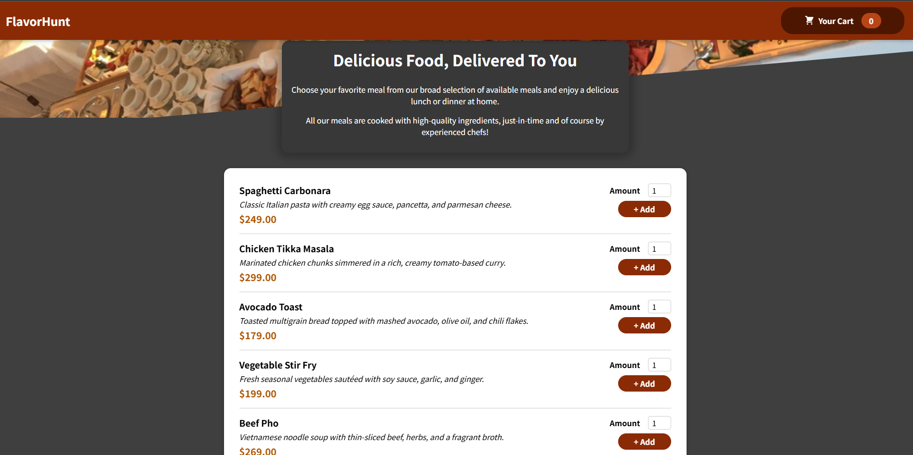
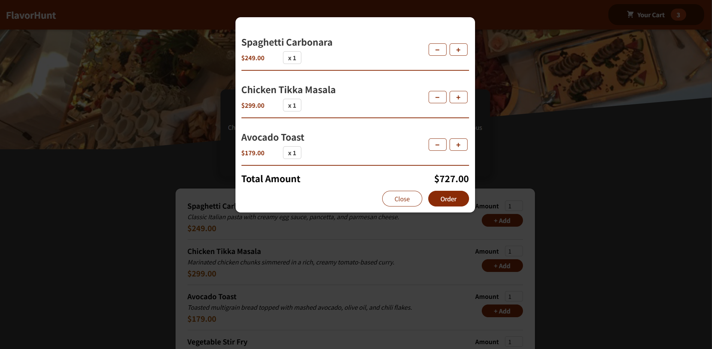

# 🍽️ Food Recipe App

A modern and responsive food recipe web application built using **Vite + React JS**, powered by **Context API** for state management and **Firebase** for backend services (authentication & Firestore database).

---

## 🚀 Live Demo

---

## 🔧 Tech Stack

-   ⚡ **Vite** — Super fast dev server
-   ⚛️ **React JS** (Javascript Clientside Library)
-   🧠 **Context API** — Lightweight global state
-   🔥 **Firebase** — Firestore DB

---

## 🧪 Screenshots

| Meals |
| ----- |

| Cart |
| ----- |

---
